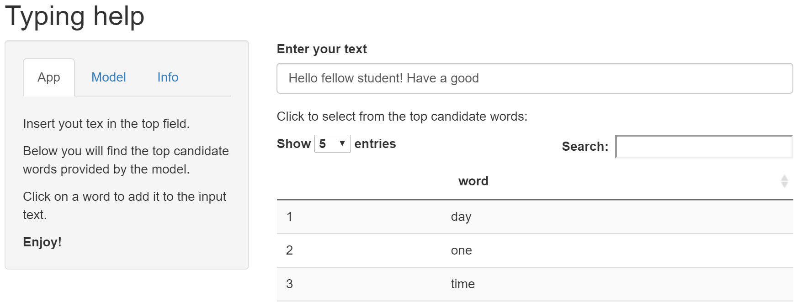

```{r setup, include=FALSE}
knitr::opts_chunk$set(echo = FALSE)
```


```{r libraries, echo=TRUE, message=FALSE}
library(dplyr)
library(tidyr)
library(tidytext)
library(ggplot2)
library(knitr)
```

## App

The app aims to assist typing for a user and predicts next word in a sentence based on the input text.

The interface is self-explanatory: one should just enter some text in the text field labeled as **Enter your text here** and get top candidate words below. Words are clickable and will be added to the input text after a click. The instruction is also provided in **App** tab on the left.

<center>

{width=85%}

</center>

## Model: Data base

To build a model a corpus from Swiftkey was used that includes following files: 

```{r file_stats, echo = FALSE, eval = TRUE}
# pivot table
names <- c("twitter", "news", "blogs")
sizes <- c(159.3641, 196.2775, 200.4242)
lines <- c(2360148, 77259, 899288)
word_numbers <- c(30557099, 2662252, 37880273)
word_numbers_unique <- c(302652, 72430, 253042)
df_stat <- data.frame(names, sizes, lines, word_numbers, word_numbers_unique)
colnames(df_stat) <- c("Source name", "File size MB", "Line number", "Word number", "Unique word number")
kable(df_stat)
```

Text from files was processed to remove punctuation and splitted to ngrams (n = 1, 2, 3, 4) with *unnest_tokens* function from *tidytext* library as shown for fourgrams:

```{r unnest_tokens, eval= FALSE, echo = TRUE}
fourgrams <-  corpus %>% unnest_tokens(fourgram, text, token = "ngrams", n = 4) %>% drop_na()
fourgrams.freq <- fourgram %>% count(fourgram, sort = TRUE)
```

After four-, tri-, bi- and unigrams were acquired, corresponding frequency tables were calculated. Many instances are observed very rarely, so for the memory optimization, only ngrams that provide 80% coverage were left for further analysis.


```{r cumplot, echo=FALSE, eval = FALSE}
if (!exists("fourgrams.freq")){
     fourgrams.freq <- read.csv("fourgrams_freq.csv")
}
fourgrams.cum.plt <- ggplot(fourgrams.freq, aes(x = as.numeric(row.names(fourgrams.freq)), y=cumsum )) + geom_line() + labs(x='Number of trigrams', y = 'Cumulative frequency')
trigrams.cum.plt + geom_hline(yintercept=0.9, linetype="dashed", color = "red") + geom_hline(yintercept=0.80, linetype="dashed", color = "green") + geom_hline(yintercept=0.50, linetype="dashed", color = "blue")
cover50 <- which(fourgrams.freq$cumsum >= 0.50)[1]
cover80 <- which(fourgrams.freq$cumsum >= 0.80)[1]
cover90 <- which(fourgrams.freq$cumsum >= 0.90)[1]
df_cover <- data.frame("coverage50" = cover50, "coverage80" = cover80, "coverage90" = cover90)
kable(df_cover)
```


## Model: algorithm

We analyze last *three* words from the input and apply a simple model:

1. Look for an exact match in fourgrams (<font color="orange"> how are you </font> <em>doing </em>)
2. Look for an exact match in trigrams ( how <font color="orange"> are you </font> <em>doing </em>)
3. Look for a soft match (words 1 and 2 or 1 and 3) in fourgrams, sort by frequency. (<font color="orange"> how are </font> you  <em>doing </em> or <font color="orange"> how  </font> are <font color="orange"> you  </font> <em>doing </em>)
4. Look for a match in bigrams ( how are <font color="orange"> you </font> <em>doing </em>)
5. If not enough, add three most popular single words (the, it, you)

As on different steps identical candidate words can be obtained, unique candidate words are filtered after each step.


## Perfomance analysis and further improvements

To analyze the model performance, we tested the model on 10000 fourgrams randomly selected from the corpus. This test is to provide an insight on model limitations.
Below results of performance test are summarized for different candidate words number.

```{r accuracy, echo = FALSE, fig.height = 2, fig.align = 'center'}
df_accuracy <- read.csv("accuracy.csv")
ggplot(df_accuracy, aes(y=Accuracy, x=N_Words, fill = N_Words)) + geom_boxplot() + scale_x_discrete(limits = c("n3", "n5", "n10"), labels=c("n3" = "N = 3", "n5" = "N = 5", "n10" = "N = 10")) + ggtitle("Accuracy vs. number of candidates") +  xlab("Number of candidates") + ylab("Accuracy") + geom_point() + theme(legend.position = "none")# + theme(aspect.ratio = 0.3)
```

<!-- There is a lot of room to improve the model, like to add weights to candidates (e.g. with Kneser-Ney algorithm as described <a href = "https://medium.com/@dennyc/a-simple-numerical-example-for-kneser-ney-smoothing-nlp-4600addf38b8"> here. </a> -->

One can see that the number of candidate words does not affect the accuracy (around 33%) much. That means that the model is already quite robust and it is unlikely that weights for the word choice (e.g. described <a href = "https://medium.com/@dennyc/a-simple-numerical-example-for-kneser-ney-smoothing-nlp-4600addf38b8"> here </a> ) will improve the accuracy. Therefore, we suggest to increase the order of ngrams and analyze 5- or 6-grams to improve accuracy.

But as NLP is a rather special field that I don't plan to work with, I assume these model and app are enough to demonstrate skills required for the specialization certificate :)